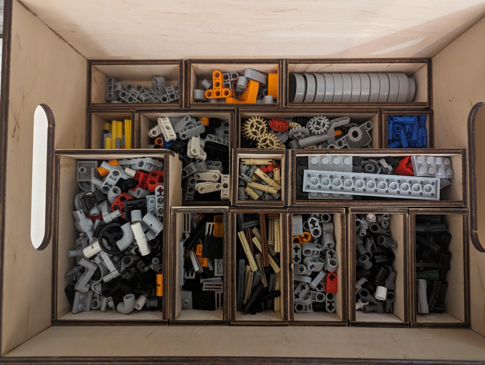

# Gridfinity for lasercuting

The project contains the DXF files make gridfinity boxes for lazer cutting

### The thingiverse page [here](https://www.thingiverse.com/thing:6406163)
The model supports customization by change D unit and W unit counts.

The repository contains DXF files for the followings sizes
- 1x1
- 1x2
- 1x3
- 1x4
- 2x2
- 2x3

The all models creating for thickness 4mm 
